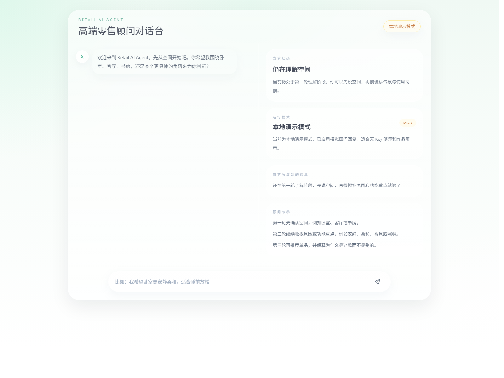

# Retail-AI-Agent

> 一个面向高端零售导购场景的 AI 对话式原型项目。
> 通过克制、优雅的交互界面，结合本地产品库检索与大模型流式回复，模拟精品商场顾问式推荐体验。



## 项目简介

Retail-AI-Agent 是一个前后端分离的轻量级原型，用于演示“高端零售顾问”式的人机对话体验。

它的核心目标不是做一个复杂的电商平台，而是验证这样一种产品方向：

- 用户先通过自然对话表达自己的生活方式、空间氛围与品质偏好
- 系统基于本地产品库进行轻量筛选
- AI 以顾问式语气逐步了解需求，并最终推荐最合适的一款产品

整个项目强调三个关键词：

- 克制的视觉表达
- 轻量的系统结构
- 可继续扩展的 AI 对话框架

## 在线展示效果

当前首页为一个偏作品展示属性的聊天界面，视觉上采用：

- 极淡薄荷绿到白色的背景渐变
- 居中毛玻璃聊天容器
- 简洁几何 AI 头像与淡色用户头像
- 对话消息的淡入与轻微上移动效
- 更接近高端零售接待界面的安静氛围，而非传统客服窗口

## 核心亮点

- 前端基于 Nuxt 3 + Tailwind CSS，适合快速搭建具有品牌感的界面原型
- 已安装 Naive UI，便于后续扩展表单、卡片、弹窗等中后台或展示组件
- 后端基于 FastAPI，结构清晰，便于继续扩展 API 与业务逻辑
- 商品数据存储在本地 JSON 文件中，不依赖数据库，部署成本更低
- `/api/products/search` 已支持基于关键词的轻量检索
- `/chat` 已预留并实现流式输出结构，便于接入 OpenAI 对话能力

## 技术栈

### 前端

- Nuxt 3
- Vue 3
- Tailwind CSS
- Naive UI

### 后端

- FastAPI
- Pydantic Settings
- OpenAI Python SDK

### 数据层

- 本地 JSON 产品库

## 项目结构

```text
Retail-AI-Agent/
|-- backend/
|   |-- app/
|   |   |-- api/
|   |   |   `-- routes/
|   |   |       `-- health.py
|   |   |-- core/
|   |   |   `-- config.py
|   |   |-- __init__.py
|   |   `-- main.py
|   |-- data/
|   |   `-- products.json
|   |-- .env.example
|   `-- requirements.txt
|-- docs/
|   `-- images/
|       `-- chat-home.png
|-- frontend/
|   |-- assets/
|   |   `-- css/
|   |       `-- main.css
|   |-- components/
|   |-- pages/
|   |   `-- index.vue
|   |-- app.vue
|   |-- nuxt.config.ts
|   |-- package.json
|   |-- postcss.config.js
|   |-- tailwind.config.ts
|   `-- pnpm-lock.yaml
|-- .gitignore
|-- LICENSE
`-- README.md
```

## 当前能力边界

这个仓库目前定位为“可演示、可继续开发”的交互原型，而不是生产环境的完整零售系统。

已具备：

- 首页视觉与聊天交互原型
- 本地商品数据管理
- 轻量商品检索
- 流式对话接口结构
- 前后端基础工程骨架

暂未完成：

- 完整的推荐解释链路追踪
- 用户身份体系
- 后台商品管理系统
- 生产级日志、鉴权与部署配置

这样的表达会更符合 GitHub 作品仓库的专业定位，也更真实。

## 本地运行

### 启动前端

```bash
cd frontend
pnpm install
pnpm dev
```

启动后访问：

- [http://127.0.0.1:3000](http://127.0.0.1:3000)

### 启动后端

```bash
cd backend
python -m venv .venv
.venv\Scripts\activate
pip install -r requirements.txt
copy .env.example .env
uvicorn app.main:app --reload --host 127.0.0.1 --port 8000
```

## 环境变量

后端使用 `backend/.env` 管理配置：

```env
APP_NAME=Retail-AI-Agent API
APP_VERSION=0.1.0
API_PREFIX=/api
OPENAI_API_KEY=your_openai_api_key_here
OPENAI_MODEL=gpt-4o-mini
```

说明：

- 如果暂时没有 `OPENAI_API_KEY`，前端页面依然可以单独打开和预览
- 只有在调用 `/chat` 时才需要真正接入模型服务

## API 概览

- `GET /`：服务状态检查
- `GET /api/health`：健康检查
- `GET /api/products/search?keyword=...`：基于本地 JSON 的商品检索
- `POST /chat`：流式对话接口，用于顾问式推荐回复

## 适合展示的方向

这个项目比较适合作为以下类型的作品展示：

- AI + 零售体验原型
- 对话式推荐系统 Demo
- 高端生活方式品牌数字化交互概念稿
- 前后端轻量联调样例

如果放在作品集或 GitHub 首页，它传达的是：

- 你有界面审美控制力
- 你能把 AI 场景落到具体交互上
- 你能从原型阶段就考虑工程结构和扩展路径

## 后续可继续增强

建议下一阶段可以考虑：

- 将 AI 回复结果结构化，附带命中商品卡片
- 增加多轮偏好记忆与推荐理由摘要
- 为产品库补充价格、材质、品牌语调、空间标签等属性
- 增加更完整的 README 演示动图或系统架构图
- 补充 Docker、部署说明和示例环境文件

## License

本项目采用 [MIT License](LICENSE)。
