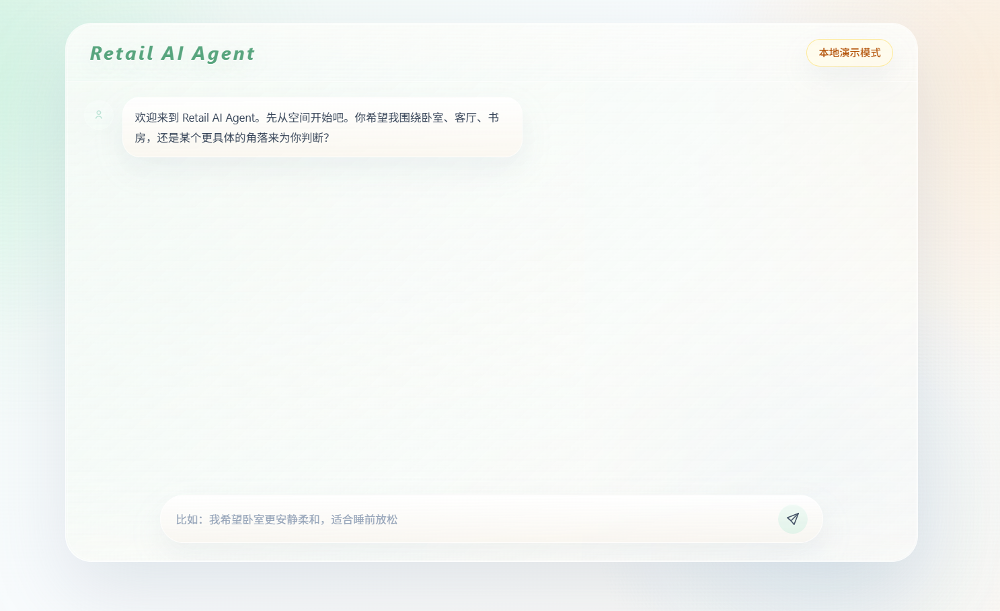
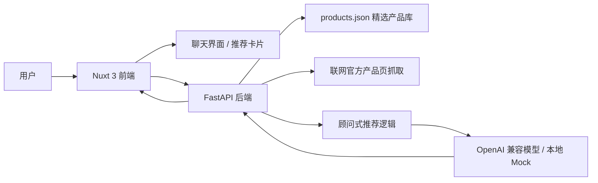
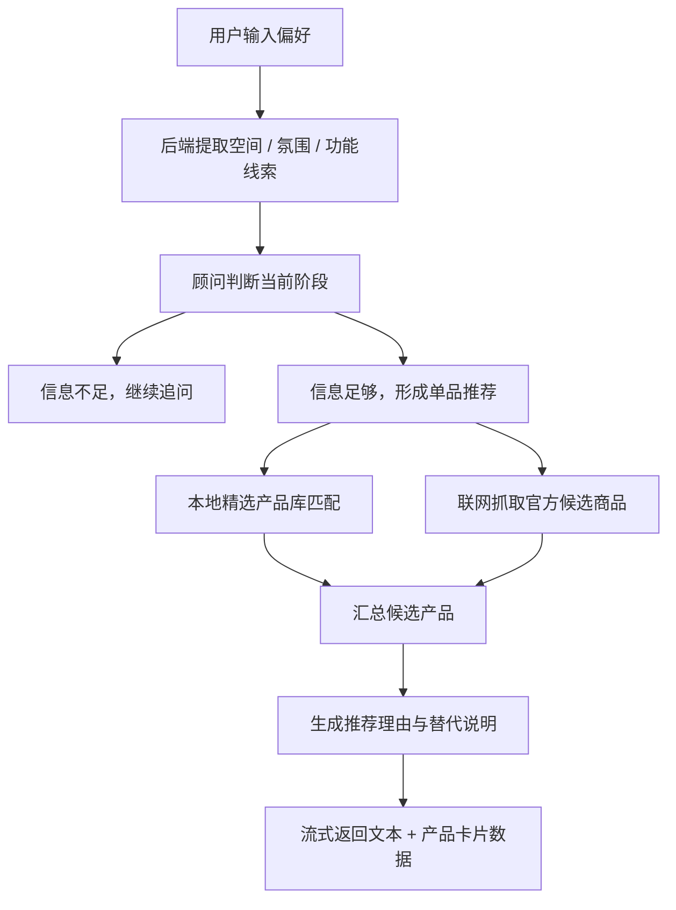

# Retail-AI-Agent

> 一个面向高端零售导购场景的 AI 对话式原型项目。  
> 通过克制、优雅的交互界面，结合本地精选产品库、实时联网搜品与大模型流式回复，模拟精品商场顾问式推荐体验。



## 项目简介

Retail-AI-Agent 是一个前后端分离的轻量级原型，用于演示“高端零售顾问”式的人机对话体验。

它不是一个完整电商平台，而是用尽量轻的工程成本，验证这样一种产品方向：

- 用户先通过自然对话表达自己的生活方式、空间氛围与品质偏好
- 系统结合本地精选产品库与实时联网结果筛选候选商品
- AI 以顾问式语气逐步了解需求，并最终推荐最合适的一款产品

这个项目重点关注三件事：

- 视觉表达要克制，不做普通客服窗口
- 推荐过程要像顾问，而不是像搜索框
- 工程结构要轻，方便继续迭代为更完整的零售体验系统

## 设计目标

### 1. 让对话节奏更像线下顾问接待

这个项目不想把首页做成常见的客服问答框，而是希望更接近线下零售顾问了解需求的过程：

- 第一轮先理解空间
- 第二轮再收拢氛围或功能
- 第三轮才推荐单品
- 推荐时交代判断依据，而不是堆砌产品参数

### 2. 先用轻量方案把体验闭环跑通

在原型阶段，重点是先把前后端链路、推荐逻辑和界面反馈跑顺，而不是过早引入更重的基础设施。因此这里采用：

- 本地 JSON 作为精选产品库
- FastAPI 作为后端服务层
- Nuxt 3 作为展示与交互层
- 流式对话作为核心体验形式
- 实时联网搜品作为补充，让结果不只局限在静态样例数据

### 3. 文档不只负责告诉你怎么跑

除了运行方式，这份文档也会把项目的设计取向、前后端链路、当前边界和后续扩展空间交代清楚。

## 当前体验

当前首页是一个偏作品展示属性的聊天界面，视觉上采用：

- 极淡薄荷绿到白色的背景渐变
- 居中毛玻璃聊天容器
- 品牌化的 `Retail AI Agent` 字标
- 对话消息的淡入与轻微上移动效
- 更接近高端零售接待界面的安静氛围，而非传统客服窗口

推荐结果已经不再只是文本，而是会落成更完整的展示信息：

- 顾问判断摘要
- 产品大图
- 品牌 / 类别 / 价格区间
- 材质与工艺说明
- 专业参数
- 命中的偏好点
- 为什么推荐这款
- 为什么暂不推荐别的
- 官网入口

## 核心亮点

- 前端基于 Nuxt 3 + Tailwind CSS，适合快速搭建具有品牌感的界面原型
- 已安装 Naive UI，便于后续扩展表单、卡片、弹窗等组件
- 后端基于 FastAPI，结构清晰，便于继续扩展 API 与业务逻辑
- 商品数据可以同时来自本地 JSON 精选库与联网官方产品页
- `/chat` 已升级为 SSE 流式响应，前端可实时显示顾问回复过程
- 后端会返回结构化推荐数据，而不是只返回自然语言段落
- 无在线模型 Key 时仍可进入本地演示模式，方便作品展示与联调

## 系统架构



## 推荐流程



## 为什么当前阶段使用 JSON，而不是数据库

这是一个刻意做出的原型阶段取舍，而不是简化偷懒。

原因主要有四个：

1. 当前产品量依然可控  
   这里只有少量精选单品，用 JSON 足够承载核心体验。

2. 重点在体验闭环，而不是数据治理  
   现阶段更重要的是“顾问体验是否成立”，而不是后台管理复杂度。

3. 降低部署与演示门槛  
   不依赖数据库意味着你可以更快地跑起来、更轻地分享、更方便地展示。

4. 仍保留升级路径  
   现在的结构并不阻碍未来迁移到 SQLite、PostgreSQL 或更复杂的推荐服务。

## 技术栈

### 前端

- Nuxt 3
- Vue 3
- Tailwind CSS
- Naive UI

### 后端

- FastAPI
- Pydantic Settings
- OpenAI Python SDK（兼容千问等 OpenAI-Compatible 提供方）

### 数据与推荐层

- 本地 JSON 精选产品库
- 联网官方产品页抓取
- 顾问式规划与结构化推荐逻辑

## 项目结构

```text
Retail-AI-Agent/
|-- backend/
|   |-- api/
|   |   `-- index.py
|   |-- app/
|   |   |-- api/
|   |   |   `-- routes/
|   |   |       `-- health.py
|   |   |-- core/
|   |   |   `-- config.py
|   |   |-- services/
|   |   |   |-- consultant_planner.py
|   |   |   |-- recommendation.py
|   |   |   `-- web_catalog.py
|   |   |-- __init__.py
|   |   |-- models.py
|   |   `-- main.py
|   |-- data/
|   |   `-- products.json
|   |-- .env.example
|   |-- requirements.txt
|   `-- vercel.json
|-- docs/
|   `-- images/
|       |-- chat-home-2026-04-09.png
|       `-- chat-home.png
|-- frontend/
|   |-- assets/
|   |   `-- css/
|   |       `-- main.css
|   |-- components/
|   |   `-- chat/
|   |       |-- InputBar.vue
|   |       |-- MessageList.vue
|   |       |-- RecommendationCard.vue
|   |       `-- StatusPanel.vue
|   |-- composables/
|   |   `-- useChatConsultant.ts
|   |-- pages/
|   |   `-- index.vue
|   |-- types/
|   |   `-- chat.ts
|   |-- app.vue
|   |-- nuxt.config.ts
|   |-- package.json
|   |-- postcss.config.js
|   |-- tailwind.config.ts
|   `-- pnpm-lock.yaml
|-- CHANGELOG.md
|-- .gitignore
|-- LICENSE
`-- README.md
```

## 当前能力边界

这个仓库目前定位为“可演示、可继续开发”的交互原型，而不是生产环境的完整零售系统。

已具备：

- 首页视觉与聊天交互原型
- 顾问式追问节奏
- 本地商品数据管理
- 实时联网产品发现
- 结构化推荐卡片展示
- 流式对话接口结构
- 无 Key 的本地演示模式

暂未完成：

- 完整的推荐解释链路追踪与日志化
- 用户身份体系
- 后台商品管理系统
- 生产级鉴权与部署配置
- 图片资源托管与正式品牌素材管理

## 本地运行

### 启动前端

```bash
cd frontend
pnpm install
pnpm dev
```

启动后访问：

- [http://127.0.0.1:3000](http://127.0.0.1:3000)

### 启动后端

```bash
cd backend
python -m venv .venv
.venv\Scripts\activate
pip install -r requirements.txt
copy .env.example .env
uvicorn app.main:app --reload --host 127.0.0.1 --port 8000
```

## Vercel 部署

这个项目建议拆成两个 Vercel Project：

1. 前端项目  
   根目录选择 `frontend`
2. 后端项目  
   根目录选择 `backend`

### 部署后端

- 在 Vercel 新建一个项目，Root Directory 选 `backend`
- 保持默认 Python 检测即可
- 后端入口已经准备好：
  - `backend/api/index.py`
  - `backend/vercel.json`

后端项目需要配置这些环境变量：

```env
APP_NAME=Retail-AI-Agent API
APP_VERSION=0.1.0
API_PREFIX=/api
ALLOWED_ORIGINS=["http://localhost:3000","http://127.0.0.1:3000"]
ALLOWED_ORIGIN_REGEX=https://.*\.vercel\.app
LLM_PROVIDER=openai_compatible
OPENAI_API_KEY=your_api_key_here
OPENAI_MODEL=qwen-plus
OPENAI_BASE_URL=https://dashscope.aliyuncs.com/compatible-mode/v1
```

### 部署前端

- 在 Vercel 再新建一个项目，Root Directory 选 `frontend`
- 在环境变量里配置：

```env
NUXT_PUBLIC_API_BASE=https://你的后端域名.vercel.app
```

前端已经改成运行时读取 `NUXT_PUBLIC_API_BASE`，所以不用再手改代码。

## 环境变量

后端使用 `backend/.env` 管理配置：

```env
APP_NAME=Retail-AI-Agent API
APP_VERSION=0.1.0
API_PREFIX=/api
LLM_PROVIDER=openai_compatible
OPENAI_API_KEY=your_api_key_here
OPENAI_MODEL=qwen-plus
OPENAI_BASE_URL=https://dashscope.aliyuncs.com/compatible-mode/v1
```

说明：

- 当前后端已兼容阿里百炼的 OpenAI 兼容接口，适合直接接入千问模型
- 如果暂时没有 `OPENAI_API_KEY`，前端页面依然可以单独打开和预览
- 此时系统会进入“本地演示模式”，使用模拟顾问逻辑完成完整中文演示
- 只有在调用在线模型时，才需要真正接入兼容接口服务

## API 概览

- `GET /`：服务状态检查
- `GET /api/health`：健康检查
- `GET /api/products/search?keyword=...`：基于本地 JSON 的商品检索
- `POST /chat`：流式对话接口，用于顾问式推荐回复

## 后续可继续增强

建议下一阶段可以考虑：

- 引入更稳定的偏好记忆层
- 让推荐结果支持多维对比与搭配建议
- 增加更完整的品牌视觉系统
- 补充动图演示与更多截图
- 引入 Docker、部署说明和正式环境管理

## 更新日志

项目更新记录见 [CHANGELOG.md](CHANGELOG.md)。

## License

本项目采用 [MIT License](LICENSE)。
